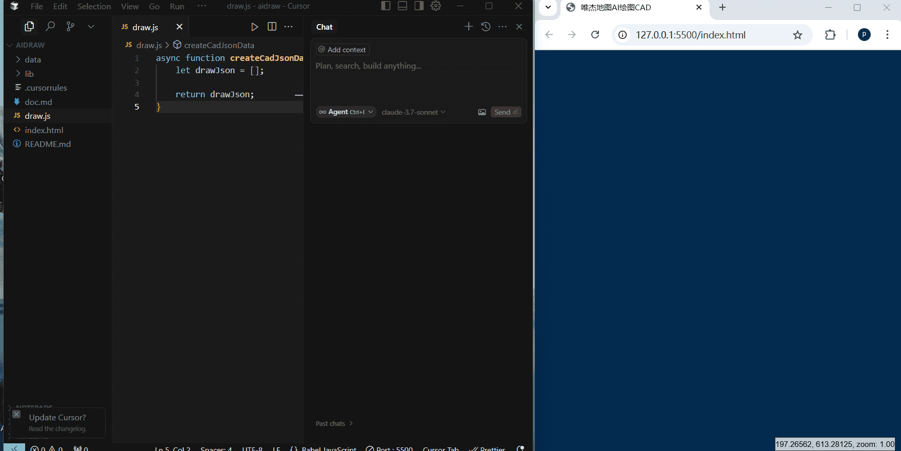

# AiDrawCAD
## 简 介
在`TRAE` 或 `Cursor` 编辑器中，输入用户需求，通过 `AI` 自动生成 `CAD` 图纸并免费下载成`DWG`格式的文件。

## 使用方法
- 1、在插件市场搜索`LiveServer`进行安装 (可选，如果有运行html的服务程序也可以不需要此步骤, 或者`直接双击index.html`文件在浏览器里面打开[此方案`不支持`获取本地文件])
- 2、选中`index.html`文件，右键，在菜单中选择`Open with Live Server`
- 3、在 `trae` 编辑器中进入`Builder` 模式， 或 `cursor` 中进入`Composer`或`Edit`模式，输入要绘制的内容进行提问
- 4、生成完成后，可以打开 `draw.js`查看生成的内容，在浏览器中刷新页面查看生成的效果。
- 5、在生成的页面中点击右上角的`下载`按钮，可下载生成的`autocad`支持的`dwg`图形文件。

## 思路
参考`doc.md`里面的内容，实现替换`draw.js`中的`createCadJsonData`函数实现，创建CAD图

## 教程

`TRAE`教程


`Cursor`教程



## 提示词示例

```
绘制一只可爱的小猫，细节要丰富
```

```
绘制常用三角函数的示例图，用于教学用，要求有刻度、坐标轴和格网，x坐标范围-10到10
```

```
画一个长80宽60厚2的板，要求周围带四个8mm孔，中心带一个16mm孔，周围圆角R5，并进行标注。
```

```
data目录中的china.json是中国地图的geojson数据, 通过这数据，绘制出中国地图，每个省需要填充颜色(颜色随机且符合地图制图规范)，同时标注名称,字体颜色为青色, 最后绘制整个图的图框
```

```
下面有几条线的坐标，用不同颜色绘制出来。第二条线用虚线绘制
[[0, 0],[4, 0]]
[[4, 0],[2, 5],[3, 7]]
[[2, 3],[0, 0]]
```

```
绘制一个停车场示例示例图（图纸宽300,高100)，2排9列，每个车位置都需要绘制出车的矩形范围、标注出编号和绘制车符号[块参照来源于克隆图形car ,克隆实体id为331, 块原来范围为[587613582,3103823616,587618261,3103825364]，基点在范围中点]。矩形范围画大点包含编号和车符号(占矩形1/2大小)，编号在上面，车符号在下面，两个不要重叠。
```

```
基于图sys_world，选择图中的"网格线"和"经纬度标注"图层，图纸绘制范围为{"min":{"x":1756,"y":2537},"max":{"x":27713,"y":17957}}。请随机绘制50个颜色不同的小圆，小圆下面标注当前序号。
```

```
根据data目录中的data.csv(第一行为每列的说明，内容为“序号,名称,x,y,值")。获取数据中每行的x,y数据绘制一个小圆，值大于100的用颜色，其余的用绿色。小圆位置下方点写上名称(颜色为青色)。(圆半径和字体高度根据所有数据的范围来确定)
```


```
以下是北京市一周的气温情况，要求绘制一个气温变化曲线图，绘制最高温度曲线(红色)和最低温度曲线(绿色)，每个值上面绘制一个小圆，同时把天气情况写在最高温度曲线对应上的点上面。X轴为日期y轴为气温,需要绘制刻度值和坐标格网
[
    {"date": "2025-02-01", "weather": "晴", "max_temp": 5, "min_temp": -4},
    {"date": "2025-02-02", "weather": "阴", "max_temp": 9, "min_temp": 0},
    {"date": "2025-02-03", "weather": "晴", "max_temp": 11, "min_temp": 8},
    {"date": "2025-02-04", "weather": "多云", "max_temp": -2, "min_temp": -6},
    {"date": "2025-02-05", "weather": "大雪", "max_temp": -4, "min_temp": -7},
    {"date": "2025-02-06", "weather": "晴", "max_temp": 6, "min_temp": -2},
    {"date": "2025-02-07", "weather": "多云", "max_temp": 6, "min_temp": -1}
]
```

## 唯杰地图介绍

`唯杰地图VJMAP`为`CAD`图或`自定义地图格式`WebGIS`可视化`显示开发提供的一站式解决方案，支持的格式如常用的`AutoCAD`的`DWG`格式文件、`GeoJSON`等常用`GIS`文件格式，它使用WebGL`矢量图块`和`自定义样式`呈现交互式地图, 提供了全新的`大数据可视化`、`实时流数据`可视化功能，通过本产品可快速实现浏览器和移动端上美观、流畅的地图呈现与空间分析，可帮助您在网站中构建功能丰富、交互性强、可定制的地图应用。

[唯杰地图](https://vjmap.com/)官网地址：https://vjmap.com/

唯杰地图特点: 


- 完全兼容`AutoCAD`格式的`DWG`文件，无需转换

- 地图提供图形的放大、缩小、自由缩放、平移、显示全图等功能，支持鼠标/单指拖拽、上下左右按键进行地图平移，支持鼠标滚轮、双击、双指进行地图缩放，支持Shift+拉框放大；支持飞行、平移等运动特效，支持`地图比较`功能，能导出PNG、PDF、SVG等格式功能；

- 多视角模式：地图支持`2D`、`3D`视角，支持垂直视角、360度旋转视角；

- `CAD`与`GIS`完美结合；地图支持CAD图渲染成`栅格瓦片`和`矢量瓦片`这两种格式，能`自定义地图`样式; 能支持`WMS`格式；支持与`互联网地图叠加`显示;

- 能对地图进行交互操作,包括点击图形查看属性信息、图层开关显示等；能对GIS数据进行`空间查询`操作；

- 支持图形`版本控制`功能；同时提供`协同`更新图形功能，可通过不同部门上传的图形或图层创建协同图形，同时当依赖的图形更新时，协同图形能自动更新至最新版本；

- 支持在Web上进行`绘制图形`功能；可绘制点、线、面、圆等类型，同时能将绘制的图形保存成dwg文件；需支持对CAD图上的坐标进行`捕捉`绘制; 需提供测距、测角度、测面积等`测量`工具;

- 支持`覆盖物`绘制、`聚合`显示、`信息窗口`、`热力图`叠加等常见的地图功能，提供丰富的js接口;

- 绘图技术先进：采用`WebGL`技术；在CAD图叠加万个点以上的用户数据时，渲染不卡顿，支持`大数据可视化`。

- 服务部署`跨平台`支持(支持`windows`,`linux`); 支持`docker`部署，地图查看完全兼容`移动端`。